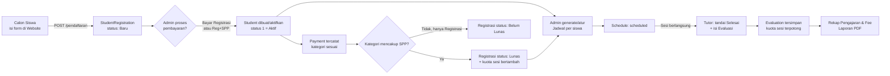
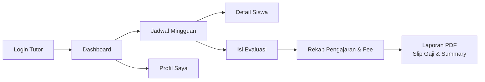

# Dokumentasi Sistem LIVO

Dokumen ini menjelaskan alur kerja dan modul-modul fungsional yang ada pada sistem LIVO (bimbingan belajar): dari pendaftaran siswa di website publik, pengelolaan data oleh admin, penjadwalan & evaluasi, hingga portal khusus tutor.

**Stack:** Laravel 13 (PHP 8.3) · Blade + Tabler UI · Yajra DataTables (server-side) · Spatie Laravel Permission (role) · Laravel Sanctum (token API) · DomPDF (cetak PDF) · PhpSpreadsheet (import/export Excel)

---

## Daftar Isi

1. [Peran Pengguna & Autentikasi](#1-peran-pengguna--autentikasi)
2. [Alur Sistem Secara Umum](#2-alur-sistem-secara-umum)
3. [Modul: Website Publik & Pendaftaran](#3-modul-website-publik--pendaftaran)
4. [Modul: Dashboard & Pendaftaran (Admin)](#4-modul-dashboard--pendaftaran-admin)
5. [Modul: Manajemen Siswa](#5-modul-manajemen-siswa)
6. [Modul: Manajemen Pembayaran](#6-modul-manajemen-pembayaran)
7. [Modul: Master Data](#7-modul-master-data)
8. [Modul: Penjadwalan (Admin)](#8-modul-penjadwalan-admin)
9. [Modul: Evaluasi (Admin)](#9-modul-evaluasi-admin)
10. [Modul: Portal Tutor](#10-modul-portal-tutor)
11. [Modul: Portal Siswa](#11-modul-portal-siswa)
12. [Referensi Skema Data](#12-referensi-skema-data)
13. [Matriks Akses per Role](#13-matriks-akses-per-role)
14. [API Tutor (Sanctum)](#14-api-tutor-sanctum)

---

## 1. Peran Pengguna & Autentikasi

Sistem memiliki **3 role** yang dikelola dengan `spatie/laravel-permission`: **admin**, **tutor**, **siswa**. Role disimpan dua kali secara sinkron — kolom `role` di tabel `users` (untuk kemudahan query) dan sebagai role Spatie (untuk middleware `role:...`).

Sumber data user berbeda per role:

| Role | Sumber data | Cara akun dibuat |
|---|---|---|
| `admin` | Murni tabel `users` | Dibuat manual (mis. via seeder) — **tidak pernah** dibuat otomatis dari data master |
| `tutor` | Master **Tutor** (kolom `email`) | Dibuat otomatis saat login pertama, ditautkan via `users.tutor_id` |
| `siswa` | Master **Student** (kolom `email`) | Dibuat otomatis saat login pertama, ditautkan via `users.student_id` |

### Alur login (2 langkah, tanpa halaman register)

```
1) Masukkan Email
        │
        ▼
   Email dikenal di tabel users?
        │
   ┌────┴─────┐
   │ Tidak    │ Ya
   ▼          ▼
Cari di    Sudah punya password?
master        │
Tutor/     ┌──┴───┐
Siswa      │Ya    │Tidak (baru pertama kali)
  │        ▼      ▼
  │    2a) Form  2b) Form Buat Password
  │      Password   (password + konfirmasi)
  │        │             │
  ▼        ▼             ▼
Ditemukan?          Password tersimpan,
  │                 status akun → "aktif",
 Ya → buat akun      langsung login
 (role sesuai
  master, status
  "pending",
  tanpa password)
  │
 Tidak → login ditolak
 ("Email tidak terdaftar")
        │
        ▼
Redirect sesuai role:
 admin → /admin   tutor → /tutor   siswa → /siswa
```

- Controller: [`app/Http/Controllers/Auth/LoginController.php`](../app/Http/Controllers/Auth/LoginController.php)
- View: [`resources/views/admin/auth/login.blade.php`](../resources/views/admin/auth/login.blade.php)
- Semua route diawali `/admin/login` walau dipakai bersama oleh ketiga role (halaman login tunggal untuk semua role).
- Akun berstatus `nonaktif` ditolak saat validasi email, sebelum sampai ke tahap password.
- Middleware `role:admin` / `role:tutor` / `role:siswa` (alias Spatie) memproteksi masing-masing area — role yang salah mendapat `403 Forbidden`, bukan redirect diam-diam.
- Akun tutor/siswa yang **tidak tertaut** ke master (mis. dibuat manual tanpa `tutor_id`/`student_id`) juga mendapat `403` saat mengakses portalnya — mencegah akun "yatim" tanpa data profil.

---

## 2. Alur Sistem Secara Umum



Alur inti: **pendaftaran publik → verifikasi & pembayaran oleh admin → siswa aktif → penjadwalan → sesi diajar tutor → evaluasi → kuota & laporan.**

---

## 3. Modul: Website Publik & Pendaftaran

Controller: [`HomeController.php`](../app/Http/Controllers/HomeController.php) — tidak butuh login.

| Route | Fungsi |
|---|---|
| `GET /` | Landing page (`website.index`) |
| `GET /pendaftaran` | Form pendaftaran calon siswa, memuat data master (mapel, program, jenjang, paket, jadwal kelas) |
| `GET /pendaftaran/cek-promo` | Validasi kode promo secara real-time (AJAX) — cek aktif/kadaluarsa |
| `POST /pendaftaran` | Simpan pendaftaran |

**Yang terjadi saat submit pendaftaran:**
1. Kode registrasi dibuat otomatis: `REG-<3huruf nama>-<timestamp>`.
2. Program (mata pelajaran) yang dipilih (multi-select) disimpan sebagai JSON nama mapel.
3. Bila kode promo diisi dan valid, `promo_id` ditautkan (harga tidak dihitung di tahap ini — hanya validasi keabsahan kode).
4. Jadwal kelas yang dipilih (bisa lebih dari satu, sesuai durasi program) diambil dari master **ClassSchedule**, lalu hari & sesi turunannya disimpan.
5. Baris `StudentRegistration` (status **`Baru`**) dan baris `Student` (status **`2` = Non-Aktif**) dibuat bersamaan — siswa baru belum "aktif" sampai admin memproses pembayaran.
6. Setiap jadwal terpilih dicatat satu baris di `ScheduleStudent` (riwayat pemilihan jadwal awal).

---

## 4. Modul: Dashboard & Pendaftaran (Admin)

Controller: [`Admin/AdminController.php`](../app/Http/Controllers/Admin/AdminController.php) — role `admin`.

- **Dashboard** (`GET /admin`): kartu ringkasan — total pendaftaran, total siswa, total omzet, pendaftaran & omzet bulan berjalan, plus tabel 10 pendaftaran terbaru (DataTables).
- **Daftar Pendaftaran** (`GET /admin/registrations`): seluruh `StudentRegistration`, dengan badge status **Baru / Belum Lunas / Lunas**.
- **Detail Pendaftaran** (`GET /admin/registrations/{id}`): menampilkan estimasi harga otomatis (`Pricing::findPrice`) berdasarkan kombinasi paket-program-jenjang-durasi bila cocok di master Harga.
- **Ubah Status** (`PATCH .../status`): mengubah status manual; bila diubah ke **Lunas**, sistem otomatis membuat/mengaktifkan data `Student` (idempotent — dicek dulu via NIS/kode registrasi agar tidak duplikat).
- **Catat Pembayaran** (`POST .../payment`): jalur utama mengaktifkan siswa dari sebuah pendaftaran —
  - Membuat/mengambil `Student` dan mengaktifkannya (`status = 1`).
  - Mencatat `Payment` (kategori **Registrasi** atau **Registrasi dan SPP**).
  - Kuota sesi hanya bertambah bila kategori mencakup SPP.
  - Status registrasi otomatis: **Lunas** bila kategori mencakup SPP, **Belum Lunas** bila baru bayar Registrasi saja.
- **Cetak Kwitansi** (`GET .../receipt`): PDF bukti pembayaran (bisa dicetak walau belum Lunas, sebagai bukti registrasi).

---

## 5. Modul: Manajemen Siswa

Controller: [`Admin/StudentController.php`](../app/Http/Controllers/Admin/StudentController.php) — role `admin`, prefix `/admin/students`.

- **CRUD lengkap** + foto profil siswa (upload ke `storage/students`, otomatis hapus foto lama saat diganti).
- **Status siswa**: `1` Aktif · `2` Non-Aktif · `3` Cuti.
- **Import/Export Excel**: template (`GET /students/template`) berisi sheet data + sheet master (Program, Jenjang, Paket, Mapel, Jadwal, Sesi) sebagai referensi ID; import (`POST /students/import`) memvalidasi tiap baris, melewati NIS duplikat, dan mengosongkan (bukan menolak) referensi master yang tidak valid agar baris tetap masuk.
- **Detail siswa** (`GET /students/{id}`): riwayat jadwal & evaluasi siswa tersebut.
- **Edit jadwal siswa**: memilih ulang jadwal kelas dari master `ClassSchedule` (difilter sesuai kelas siswa) — perubahan menyelaraskan ulang baris `ScheduleStudent` bertanda "Jadwal Pendaftaran" tanpa mengganggu jadwal tambahan manual lain.

---

## 6. Modul: Manajemen Pembayaran

Controller: [`Admin/PaymentController.php`](../app/Http/Controllers/Admin/PaymentController.php) — role `admin`, prefix `/admin/payments`.

**Kategori pembayaran:** `1` Registrasi · `2` SPP · `3` Kegiatan · `4` Registrasi dan SPP (kuota sesi bertambah hanya untuk kategori `2` & `4`).

**Field masa aktif pembelajaran** (form create/edit):
- **Tanggal Aktif Pembelajaran** — tanggal mulai masa belajar siswa untuk pembayaran ini.
- **Periode** — 1/2/3 bulan (1 bulan = 30 hari).
- **Tanggal Expired** — dihitung otomatis: tanggal aktif + (periode × 30 hari); untuk periode selain 1 bulan, hasilnya dibulatkan ke **akhir bulan**. Tetap bisa diedit manual, dengan peringatan visual bila hasil edit manual jatuh bukan di akhir bulan.
- **Masa Aktif (hari)** — default = selisih tanggal aktif ke tanggal expired, tapi bisa diubah manual secara independen (tidak terikat perhitungan periode).

**Fitur lain:**
- Nomor pembayaran otomatis: `LVR-<YYMMDD><urutan 4 digit>`.
- Nominal otomatis terisi dari master **Harga** (Pricing) bila kombinasi paket/program/jenjang/durasi siswa cocok.
- Import/Export Excel dengan pola sheet master sama seperti modul Siswa.
- Cetak kwitansi PDF (`GET /payments/{id}/receipt`) lengkap dengan QR code verifikasi & nominal terbilang.

---

## 7. Modul: Master Data

Seluruh modul di bawah ini CRUD sederhana (modal tambah/edit + DataTables), role `admin`, prefix `/admin/...`:

| Modul | Model | Field kunci |
|---|---|---|
| Paket Belajar | `Package` | nama paket, harga, total sesi |
| Promo & Diskon | `Promo` | kode, tipe diskon (persen/nominal), berlaku dari–sampai, status aktif |
| Mata Pelajaran | `Subject` | nama mapel, daftar jenjang yang berlaku (`grade_ids`) |
| Silabus (per mapel) | `Syllabus` | pokok & sub pokok bahasan, jenis kurikulum, kelas — juga mendukung import/export Excel |
| Program | `Program` | nama program, kuota, durasi (frekuensi per minggu) |
| Jenjang | `Grade` | nama jenjang |
| Harga | `Pricing` | kombinasi unik paket + program + jenjang + durasi → harga |
| Jadwal Kelas | `ClassSchedule` | sesi, program, hari, kelas — dipakai sebagai pilihan jadwal saat pendaftaran/edit siswa |
| Sesi Pembelajaran | `ScheduleSession` | nama sesi, jam mulai–selesai |
| **Tutor** | `Tutor` | nama, telepon, email (kunci login), no. rekening, **fee per sesi**, spesialisasi (multi-mapel), foto |

> Master **Tutor** berperan ganda: selain data operasional, kolom `email`-nya adalah kunci penautan akun login tutor (lihat bagian 1), dan `fee_per_session` adalah dasar perhitungan Rekap Fee & Slip Gaji di portal tutor (bagian 10).

---

## 8. Modul: Penjadwalan (Admin)

Controller: [`Admin/ScheduleController.php`](../app/Http/Controllers/Admin/ScheduleController.php) — role `admin`, prefix `/admin/schedules`.

- **Kalender & tabel jadwal** (FullCalendar + DataTables) dengan filter status & tutor. Warna event: biru = terjadwal, hijau = selesai, abu = dibatalkan.
- **Generate otomatis** (`POST /schedules/generate`): membuat jadwal satu minggu untuk seluruh siswa aktif berdasarkan hari & sesi yang tersimpan di profil siswa (fallback ke data pendaftaran bila belum diisi). Menghormati sisa kuota sesi siswa — tidak generate melebihi kuota, dan melewati siswa yang jadwalnya sudah ada di tanggal/jam yang sama.
- **CRUD manual jadwal**: tambah/edit/hapus satu jadwal (siswa, tutor, mapel, tanggal, jam).
- **Status jadwal**: `scheduled` → `done` (tandai selesai) atau `canceled` (batalkan).
- **Isi evaluasi dari jadwal** (khusus admin, sebagai jalur alternatif dari portal tutor) — sesi yang sudah `done` menampilkan status "Sudah/Belum" dievaluasi.
- **Import evaluasi via Excel** (`POST /schedules/import-evaluation`) — untuk input evaluasi massal.

---

## 9. Modul: Evaluasi (Admin)

Controller: [`Admin/EvaluationController.php`](../app/Http/Controllers/Admin/EvaluationController.php) — role `admin`, prefix `/admin/evaluations`.

- **Daftar evaluasi** (`GET /evaluations`): seluruh sesi yang sudah dievaluasi, dengan filter jenjang, mapel, rentang tanggal.
- **Laporan per siswa** (`GET /evaluations/student/{id}`): statistik (total sesi, rata-rata nilai, rekap kehadiran) + tabel rinci per sesi (materi, kehadiran, post test, 4 aspek penilaian, catatan tutor).
- **Terbitkan/Sembunyikan** (`PUT .../publish`): kontrol visibilitas laporan evaluasi — hanya evaluasi berstatus **terbit** yang idealnya dapat dilihat pihak luar (mis. orang tua, bila modul tersebut dikembangkan).
- **Export**: ringkasan PDF (`summary-pdf`) dan rincian Excel (`excel`) per siswa.
- **Logika bersama dengan portal tutor** (lihat `app/Http/Controllers/Concerns/ManagesEvaluations.php`):
  - Materi bersifat **saling eksklusif**: pilih dari **Silabus** atau isi **manual** ("Lainnya"), tidak keduanya.
  - **Sinkronisasi kuota sesi**: kehadiran `hadir`/`alfa` memotong 1 kuota sesi siswa (ditandai `quota_consumed` agar tidak terpotong dobel saat evaluasi diedit ulang); kehadiran `izin` tidak memotong, dan mengubah dari status pemotong ke `izin` mengembalikan kuota.

---

## 10. Modul: Portal Tutor

Seluruh halaman di bawah **hanya bisa diakses akun ber-role `tutor`** yang tertaut ke master Tutor (`users.tutor_id`). Layout terpisah dari admin: [`resources/views/tutor/layouts/app.blade.php`](../resources/views/tutor/layouts/app.blade.php), prefix route `/tutor`.



| Halaman | Route | Ringkasan |
|---|---|---|
| **Dashboard** | `GET /tutor` | Akumulasi sesi (total, bulan ini, akan datang), akumulasi siswa diajar, jumlah evaluasi yang belum diisi, serta review hasil penilaian (rata-rata post test & 4 aspek, breakdown kehadiran, 8 evaluasi terbaru) |
| **Jadwal Mingguan** | `GET /tutor/jadwal` | Jadwal dikelompokkan per hari (Senin–Minggu), navigasi minggu lalu/ini/depan, menampilkan kelas/ruang & sesi per baris |
| **Detail Siswa** | `GET /tutor/siswa/{id}` | Profil siswa + statistik & riwayat sesi (DataTables) — **hanya siswa yang pernah/akan diajar tutor tsb.**, selain itu `403` |
| **Evaluasi Siswa** | `GET /tutor/evaluasi` | Daftar sesi yang evaluasinya belum diisi (selesai atau lewat tanggal tapi belum ditandai), dengan form isi evaluasi lengkap |
| **Profil Saya** | `GET /tutor/profil` | Lihat data diri; tutor hanya boleh mengubah **kontak, no. rekening, dan foto** (dengan preview instan) — nama/email/spesialisasi tetap dikelola admin |
| **Rekap Pengajaran** | `GET /tutor/rekap-pengajaran` | Statistik & tabel rinci sesi selesai per bulan (materi, kehadiran, nilai, catatan) |
| **Rekap Fee** | `GET /tutor/rekap-fee` | Tabel 12 bulan: jumlah sesi selesai × fee per sesi (dari master Tutor), per tahun |
| **Laporan** | `GET /tutor/laporan` | Unduh **Slip Gaji** (PDF A5) dan **Summary Pengajaran** (PDF A4 landscape) untuk bulan terpilih |

Saat sesi ditandai selesai lewat pengisian evaluasi (bukan lewat admin), status jadwal otomatis berubah `scheduled` → `done`. Seluruh tabel data (evaluasi pending, riwayat siswa, rekap pengajaran) memakai **DataTables server-side** yang sama dengan panel admin.

---

## 11. Modul: Portal Siswa

Role `siswa` sudah tersedia (login, provisioning dari master Student, middleware `role:siswa`, route `/siswa`), namun saat ini baru berupa halaman placeholder ([`resources/views/siswa/dashboard.blade.php`](../resources/views/siswa/dashboard.blade.php)). Belum ada fitur fungsional spesifik siswa (mis. lihat jadwal sendiri, lihat hasil evaluasi, riwayat pembayaran) — infrastruktur autentikasi & role-nya sudah siap dipakai saat modul ini dikembangkan.

---

## 12. Referensi Skema Data

Relasi inti (nama tabel):

```
users ──belongsTo──> tutors      (users.tutor_id, untuk role tutor)
users ──belongsTo──> students    (users.student_id, untuk role siswa)

student_registrations ──1:1(soft)──> students   (via nis / registration_code / student_id)
students ──hasMany──> payments
students ──hasMany──> schedules
students ──hasMany──> schedule_students   (riwayat pemilihan jadwal)

tutors ──hasMany──> schedules

schedules ──belongsTo──> students, tutors, subjects
schedules ──hasOne──> evaluations

evaluations ──belongsTo──> schedules, syllabi (nullable, eksklusif dgn materi_manual)

class_schedules ──belongsTo──> schedule_sessions, programs
pricings: unique(package_id, program_id, grade_id, duration) → price
```

**Enum/status penting:**

| Field | Nilai |
|---|---|
| `users.role` | `admin`, `tutor`, `siswa` |
| `users.status` | `pending`, `aktif`, `nonaktif` |
| `student_registrations.status` | `Baru`, `Belum Lunas`, `Lunas` |
| `students.status` | `1` Aktif, `2` Non-Aktif, `3` Cuti |
| `schedules.status_schedule` | `scheduled`, `done`, `canceled` |
| `payments.category_payment` | `1` Registrasi, `2` SPP, `3` Kegiatan, `4` Registrasi dan SPP |
| `payments.payment_method` | `cash`, `transfer` |
| `payments.period` | `1`, `2`, `3` (bulan) |
| `evaluations.student_attendance` | `hadir`, `izin`, `alfa` |

---

## 13. Matriks Akses per Role

| Modul | Admin | Tutor | Siswa |
|---|:---:|:---:|:---:|
| Website publik & pendaftaran | — (publik) | — | — |
| Dashboard & pendaftaran | ✅ | ❌ | ❌ |
| Manajemen siswa | ✅ | ❌ | ❌ |
| Manajemen pembayaran | ✅ | ❌ | ❌ |
| Master data | ✅ | ❌ | ❌ |
| Penjadwalan (kelola) | ✅ | ❌ | ❌ |
| Evaluasi (kelola semua siswa) | ✅ | ❌ | ❌ |
| Dashboard tutor | ❌ | ✅ (data sendiri) | ❌ |
| Jadwal mingguan & detail siswa | ❌ | ✅ (siswa sendiri) | ❌ |
| Isi evaluasi | ❌ | ✅ (jadwal sendiri) | ❌ |
| Profil tutor | ❌ | ✅ (data sendiri) | ❌ |
| Rekap pengajaran & fee, laporan | ❌ | ✅ (data sendiri) | ❌ |
| Dashboard siswa | ❌ | ❌ | ✅ (placeholder) |

Proteksi akses ditegakkan berlapis: middleware `role:*` di routing, dan pengecekan kepemilikan data (mis. tutor hanya bisa membuka siswa/jadwal miliknya sendiri) di level controller — pelanggaran menghasilkan `403 Forbidden`.

---

## 14. API Tutor (Sanctum)

Seluruh fungsi Portal Tutor (bagian 10) juga tersedia sebagai **REST API berformat JSON** memakai **Laravel Sanctum** (token *personal access token*, stateless — bukan cookie SPA), untuk dikonsumsi aplikasi terpisah (mis. aplikasi mobile). Prefix seluruh endpoint: **`/api/tutor`**.

> Referensi lengkap tiap endpoint (payload, contoh response, format error) ada di dokumen terpisah: **[API-TUTOR.md](API-TUTOR.md)**.

Logika inti (provisioning akun, resolusi profil tutor, kuota/materi evaluasi, statistik rekap) **dipakai bersama** dengan controller web lewat trait di `app/Http/Controllers/Concerns/` (`ProvisionsUserFromMaster`, `ResolvesTutor`, `ManagesEvaluations`, `ComputesTutorTeachingStats`) — perilaku API dan web dijamin konsisten karena berasal dari kode yang sama, bukan duplikasi.

### 14.1 Autentikasi (publik)

Meniru alur 2 langkah di bagian 1, versi stateless bertoken:

| Method & Path | Fungsi |
|---|---|
| `POST /api/tutor/auth/check-email` | Kirim `{ email }`. Jika belum ada akun, sistem mencoba provisioning dari master Tutor (sama seperti web). Balasan: `{ email, name, has_password }` — client memakai `has_password` untuk menampilkan form password atau form buat password. Email yang tidak dikenal / bukan role tutor → `422` dengan pesan validasi. |
| `POST /api/tutor/auth/login` | `{ email, password, device_name? }` → bila valid, **menerbitkan token** (`token`, `token_type`, `user`, `tutor`). Password salah / bukan tutor / akun nonaktif → `422`. |
| `POST /api/tutor/auth/create-password` | `{ email, password, password_confirmation, device_name? }` — hanya untuk akun yang **belum** punya password (hasil provisioning). Berhasil → status akun jadi `aktif` dan langsung menerbitkan token. Akun yang sudah punya password ditolak (`422`) — arahkan ke `/login`. |

Seluruh request/response berformat JSON (`Accept: application/json`). Token dikirim balik sebagai `Bearer` token untuk dipakai di header `Authorization` pada seluruh endpoint terproteksi berikut.

### 14.2 Endpoint terproteksi (`auth:sanctum` + `role:tutor`)

Header wajib: `Authorization: Bearer <token>`. Token milik akun tutor yang **tidak tertaut** ke master Tutor tetap mendapat `403` (sama seperti web). Token milik role lain mendapat `403` dari middleware `role:tutor`; tanpa token/token tidak valid → `401`.

| Method & Path | Fungsi | Setara halaman web |
|---|---|---|
| `GET /auth/me` | Info akun + profil tutor yang sedang login | — (bootstrap client) |
| `POST /auth/logout` | Cabut token yang sedang dipakai (logout perangkat ini saja) | — |
| `GET /dashboard` | Statistik akumulasi sesi & siswa, review penilaian, 8 evaluasi terbaru | Dashboard |
| `GET /schedules/week?week=YYYY-MM-DD` | Jadwal satu minggu, dikelompokkan per tanggal | Jadwal Mingguan |
| `GET /students/{id}` | Profil siswa + statistik bersama tutor ini (`403` bila bukan siswa tutor tsb.) | Detail Siswa |
| `GET /students/{id}/history?page=&per_page=` | Riwayat sesi siswa, dipaginasi | Riwayat sesi (tabel) |
| `GET /evaluations?page=&per_page=` | Daftar sesi yang evaluasinya belum diisi, dipaginasi | Evaluasi Siswa (daftar) |
| `GET /evaluations/{schedule}` | Detail sesi + opsi silabus mapel terkait, untuk mengisi form | Form Isi Evaluasi |
| `POST /evaluations/{schedule}` | Simpan evaluasi (materi, kehadiran, nilai, catatan) — memotong/mengembalikan kuota sesi siswa secara otomatis, sesi lewat otomatis ditandai selesai | Submit Isi Evaluasi |
| `GET /profile` | Data profil tutor | Profil Saya |
| `POST /profile` | Perbarui kontak/no. rekening/foto (`multipart/form-data`; `POST` dipakai karena upload file, bukan `PUT`) | Update Profil |
| `GET /rekap-pengajaran?month=YYYY-MM&page=` | Statistik + daftar sesi selesai bulan tsb., dipaginasi | Rekap Pengajaran |
| `GET /rekap-fee?year=YYYY` | 12 baris bulanan: jumlah sesi × fee per sesi, plus total tahunan | Rekap Fee |
| `GET /reports/slip-gaji?month=YYYY-MM` | Unduh **PDF** slip gaji bulan tsb. | Laporan → Slip Gaji |
| `GET /reports/summary?month=YYYY-MM` | Unduh **PDF** summary pengajaran bulan tsb. | Laporan → Summary |

### 14.3 Catatan implementasi

- Tabel data (evaluasi pending, riwayat siswa, rekap pengajaran) memakai **pagination JSON standar Laravel** (`?page=`, `?per_page=`), bukan format Yajra DataTables yang dipakai di web — lebih sesuai untuk konsumsi client non-Blade.
- Endpoint laporan (slip gaji & summary) tetap mengembalikan **berkas PDF biner** (bukan JSON) memakai template Blade yang sama dengan web, agar hasil cetak konsisten.
- Migrasi `personal_access_tokens` (bawaan Sanctum) menyimpan token; tidak ada *token expiration* default — cabut token via `POST /auth/logout` saat selesai dipakai.
- Endpoint ini **khusus role tutor**. Pola yang sama (trait `ResolvesTutor` → `ResolvesSiswa`, dst.) dapat direplikasi untuk API role admin/siswa saat modul tersebut dikembangkan.
